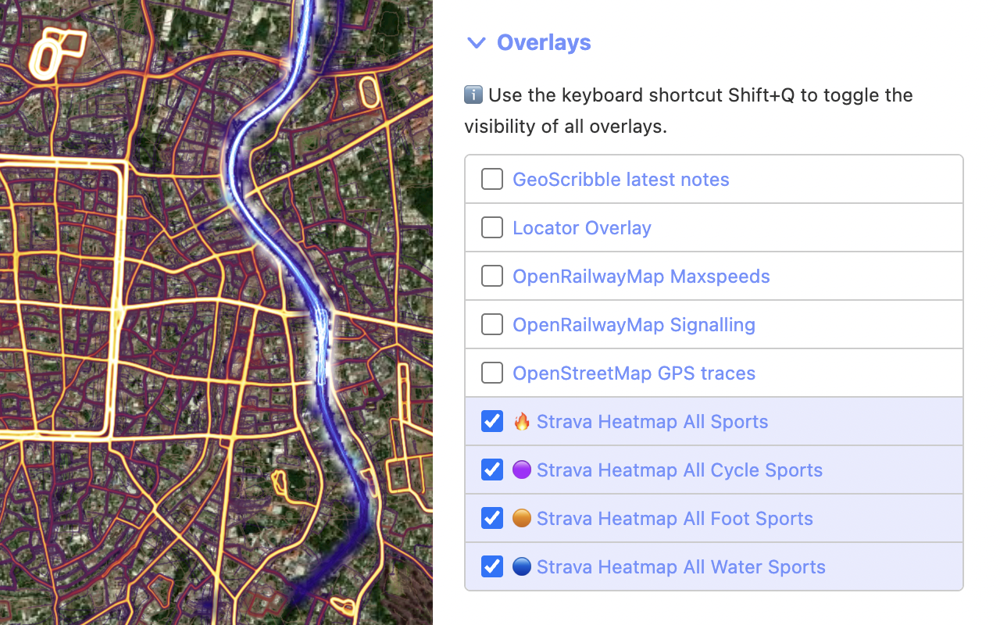

# iD Strava Heatmap extension

This browser extension integrates the [Strava Global Heatmap](https://www.strava.com/maps/global-heatmap) seamlessly into the OpenStreetMap [iD editor](https://www.openstreetmap.org/edit?editor=id), enhancing your mapping experience by providing easy access to Strava activity data.

&nbsp;

## Installation / Updates

Available as a [Chrome extension](https://chrome.google.com/webstore/detail/eglbcifjafncknmpmnelckombmgddlco) and a [Firefox add-on](https://addons.mozilla.org/en-US/firefox/addon/id-strava-heatmap/).

### Versions

See the [Changelog](./CHANGELOG.md) for details.

## Instructions

Follow these steps to activate the Strava Heatmap in the iD editor:

1. Install the extension in your browser and pin it to your toolbar.
2. Go to https://www.openstreetmap.org/edit?editor=id to open the iD editor.
3. Press B or click Background Settings, then scroll to the Overlays section.
4. Select any Strava Heatmap overlay from the list.
5. Click the red extension icon to log in to Strava. Sign up here if needed: https://www.strava.com/
6. After logging in, click the green extension icon to set activity type, color, and opacity.
7. Press Shift+Q to toggle overlay visibility, and Shift+W to toggle data visibility.

### Troubleshooting

**Q: “Click the Strava Heatmap extension icon to log into Strava and enable the heatmap.” — What does this mean?**  
**A:** This message appears if you're not logged in to Strava and haven’t visited the [Strava Global Heatmap](https://www.strava.com/heatmap). Just click the extension icon to sign in and authorize access.

### Feature and Bug Requests

Submit issues and feature requests in the [Issues](https://github.com/cmoffroad/id-strava-heatmap-extension/issues) section above.

## Background

Previously, accessing Strava heatmap imagery required a tedious process of extracting Strava website cookies and generating a temporary URL that would expire after a week.

The [JOSM Strava Heatmap Extension](https://github.com/zekefarwell/josm-strava-heatmap) simplified this process, but due to the lack of support for custom overlays in the iD editor, users could only add the URL as a custom background.

With this extension, you can now automatically access all Strava activities as Heatmap overlays, eliminating the need for manual URL management.

To learn more about using the Strava Heatmap in OpenStreetMap, visit the [Strava wiki](https://wiki.openstreetmap.org/wiki/Strava).

### Support for Other Editors

Currently, there are no plans to support other editors, as this extension is designed specifically for iD.

- For JOSM, check out the [JOSM Strava Heatmap Extension](https://github.com/zekefarwell/josm-strava-heatmap).
- For RapidId, refer to the [RapId Power User Extension](https://github.com/emersonveenstra/rapid-power-user-extension/).
