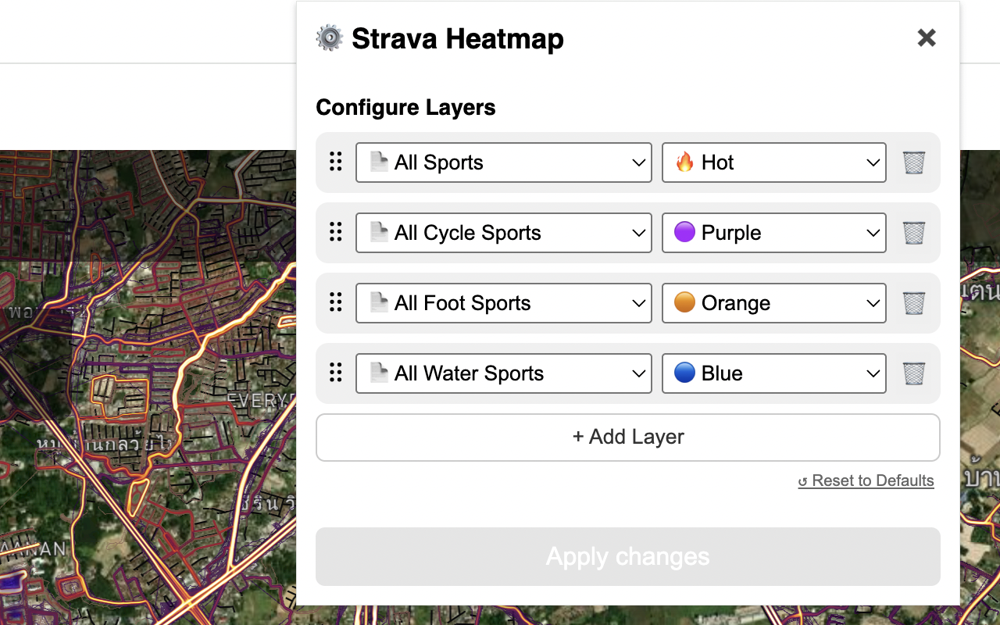

# iD Strava Heatmap Extension

This browser extension integrates the [Strava Global Heatmap](https://www.strava.com/heatmap) seamlessly into the OpenStreetMap [iD editor](https://www.openstreetmap.org/edit?editor=id), enhancing your mapping experience by providing easy access to Strava activity data.

## Installation / Updates

Available as a [Chrome extension](https://chrome.google.com/webstore/detail/eglbcifjafncknmpmnelckombmgddlco) and a [Firefox add-on](https://addons.mozilla.org/en-US/firefox/addon/id-strava-heatmap/).

### Versions

See the [Changelog](./CHANGELOG.md) for details.

## Background

Previously, accessing Strava heatmap imagery required a tedious process of extracting Strava website cookies and generating a temporary URL that would expire after a week.

The [JOSM Strava Heatmap Extension](https://github.com/zekefarwell/josm-strava-heatmap) simplified this process, but due to the lack of support for custom overlays in the iD editor, users could only add the URL as a custom background.

With this extension, you can now automatically access all Strava activities as Heatmap overlays, eliminating the need for manual URL management.

To learn more about using the Strava Heatmap in OpenStreetMap, visit the [Strava wiki](https://wiki.openstreetmap.org/wiki/Strava).

## Instructions

To get started, follow these steps:

1. Install the extension in your browser.  
2. Log in to [Strava](https://www.strava.com/login). If you don’t have an account, sign up for a free one.  
3. Visit the [Strava Global Heatmap](https://www.strava.com/heatmap).  
4. Open the [iD editor](https://www.openstreetmap.org/edit?editor=id).  
5. In the iD editor, open **Background Settings** (shortcut: `B`).  
6. Scroll down to the **Overlays** section.  
7. Choose **Strava Heatmap (All)** to display all activities, or select a specific category such as **Ride, Run, Water,** or **Winter**.

## Troubleshoot

**Q:** Why does the Strava Heatmap display the message "Log in at strava.com/login and navigate to Maps to view the overlay"?  
**Q:** Why is the Strava Heatmap appearing blurred?

**A:** Ensure you're signed in to Strava.com and have visited the Strava Global Heatmap page. Then, reload the iD editor to apply the changes.

## Feature and Bug Requests

Submit issues and feature requests in the [Issues](https://github.com/cmoffroad/id-strava-heatmap-extension/issues) section above.

## Support for Other Editors

Currently, there are no plans to support other editors, as this extension is designed specifically for iD.

* For JOSM, check out the [JOSM Strava Heatmap Extension](https://github.com/zekefarwell/josm-strava-heatmap).
* For RapidId, refer to the [RapId Power User Extension](https://github.com/emersonveenstra/rapid-power-user-extension/).
